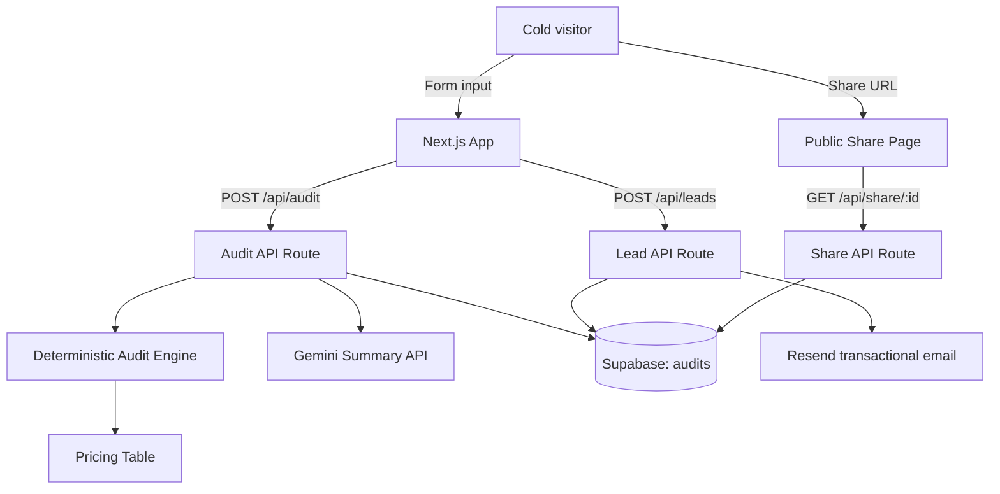

# Architecture

## System diagram

## Data flow
1. User submits form data (tools, plan, spend, seats, team size, use case).
2. `runAuditEngine` applies deterministic rules using `TOOL_PRICING`.
3. The audit result and pricing rationale are returned immediately.
4. The audit is stored in Supabase along with a shareId.
5. A Gemini summary is generated (with fallback to template on failure).
6. If the user submits an email, a lead record is stored and a Resend email is sent.

## Abuse protection
- Honeypot field on lead capture (bots fill it, humans never see it).
- Simple IP-based rate limiting in API routes to deter rapid submissions.

## Stack rationale
- Next.js App Router: single codebase for UI + API.
- TypeScript: prevents pricing and logic errors.
- Tailwind: fast, custom, non-generic styling.
- Supabase: rapid storage + public share URLs.
- Resend: reliable transactional email.
- Gemini: high-quality summaries with safe fallback.

## Scaling to 10k audits/day
- Move rate limiting to edge middleware backed by Redis.
- Precompute summaries using a background queue (e.g., Upstash/QStash).
- Add caching for share pages and API results.
- Add structured logging + observability.
- Use Supabase read replicas or a dedicated Postgres.
